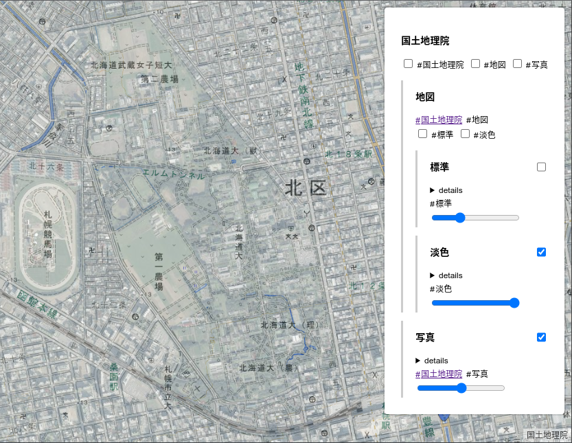

# mapmapviewer-control

This is a control for map visiblity, opacity, and filtering by tags to MapLibre GL JS. [demo](https://mag-geo.github.io/mapmapviewer-control/)



## Installation

```bash
pnpm add mag-geo/mapmapviewer-control
```

## Usege

See [demo/main.ts](./demo/main.ts).

```js
// Import the plugin
import { MapMapViewerControl } from 'mapmapviewer-control';
import 'mapmapviewer-control/dist/style.css';

// const map = new Map({ ... });
// const options = { ... };

map.on('load', () => {
  // Add sample control
  const Sample = new MapMapViewerControl(options);
  map.addControl(Sample);
});
```

## Credits

This project is based on [the MapLibre GL JS documentation](https://maplibre.org/maplibre-gl-js/docs/) and [the Svelte documentation](https://svelte.dev/docs/).

It is based on [xiupos/maplibre-gl-sample-svelte-control](xiupos/maplibre-gl-sample-svelte-control).

## License

This project is licensed under the MIT License.
